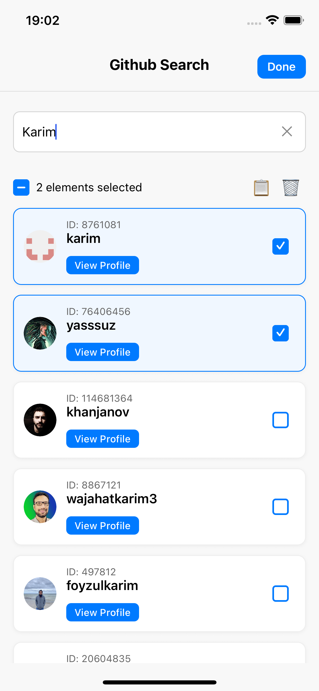
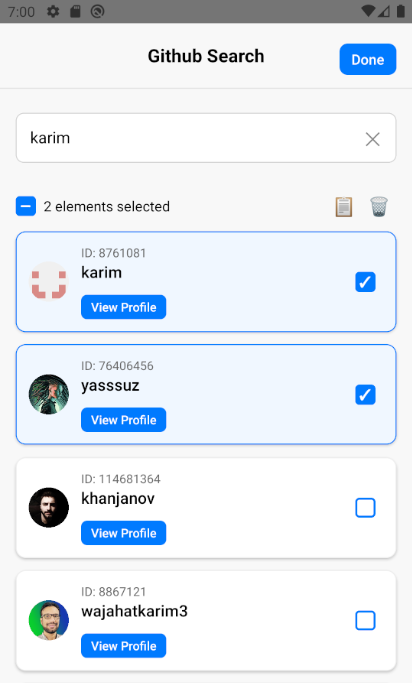

# GitHub User Search - React Native

A React Native application demonstrating an advanced search feature with user selection, duplication, and deletion functionality. This project is built with TypeScript and follows an MVVM pattern with separation of domain, data, and presentation layers. It is developed without adding any external dependency libraries to a freshly created React Native app, except for testing libraries.

---

## ✨ Features

### Core Functionality
- 🔍 **Search Github users** with a debounced API call (500ms).
- ✅ **Multi-select System** with individual selection and select all.
- 🎯 **Multiple operations**:
  - Delete multiple users at once.
  - Duplicate multiple users at once.
- 🎨 **Edit Mode Toggle** for switching between view and edit mode.
- 🛠️ **Error handling** and loading indicators.
- ⏳ **GitHub API rate limit management** to handle API call restrictions.

### UX Highlights
- Minimum 3 characters required for search
- Automatic request cancellation on new searches
- Visual feedback for selection states (all, some, none)
- Keyboard dismissal on scroll
- Clean, intuitive interface

---

## Screenshots

 

---

## ⚙️ Installation

### Getting Started

> **Note**: Make sure you have completed the [Set Up Your Environment](https://reactnative.dev/docs/set-up-your-environment) guide before proceeding.

### Step 1: Clone & installation

Clone the repository and install dependencies:

```bash
git clone https://github.com/k-angama/github-search-react-native.git
cd github-search-react-native
npm install
```

### Step 2: Running the app

```sh
npm start
```

### Step 3: Build and run your app

#### Android

```sh
npm run android
```

#### iOS

For iOS, remember to install CocoaPods dependencies (this only needs to be run on first clone or after updating native deps).

```sh
cd iOS/
pod install
cd ..
```

For more information, please visit [CocoaPods Getting Started guide](https://guides.cocoapods.org/using/getting-started.html).

```sh
npm run ios
```

If everything is set up correctly, you should see your new app running in the Android Emulator, iOS Simulator, or your connected device.

This is one way to run your app — you can also build it directly from Android Studio or Xcode.

---

## 🏗️ Architecture

This project separates presentation from business logic with clear boundaries and responsibilities.

### Layer Structure

```
📁 data/           → Data sources and API implementations
📁 domain/         → Entities, and repository interfaces
📁 presentation/   → UI components, screens, and view models (Business logic)
```

```
┌─────────────────────────────────────┐
│     Presentation Layer (UI)         │
│  - Components, Screens,             │
│  - ViewModels (Business logic).     │
└──────────────┬──────────────────────┘
               │
┌──────────────▼──────────────────────┐
│            Domain Layer             │
│    - Repository Implementation      │
│    - Entities                       │
└──────────────┬──────────────────────┘
               │
┌──────────────▼──────────────────────┐
│      Data Layer (Data Sources)      │
│  - API Client (GithubApiDataSource) │
│  - External Services                │
└─────────────────────────────────────┘
```

### Design Patterns

- **MVVM (Model-View-ViewModel)**: Separates UI from business logic
- **Repository Pattern**: Abstracts data sources behind interfaces
- **Dependency Injection**: Configurable and testable dependencies

---

## 📂 Project Structure

```
src/
├── data/                                # Data Layer
│   ├── GithubApiDataSource.ts           # GitHub API client
│   ├── RateLimitError.ts                # Custom error for GitHub API rate limits
│   └── UsersResponseRaw.ts              # API response type definitions
│
├── domain/                              # Domain Layer
│   ├── mock/
│   │   └── SearchUserMockRepository.ts  # Mock for testing/development
│   ├── SearchUserRepository.ts          # Repository interface contract
│   └── UserEntity.ts                    # User domain model
│
├── presentation/                       # Presentation Layer
│   ├── components/                     # Reusable UI components
│   │   ├── ActionBar.tsx               # Bulk action toolbar
│   │   ├── Checkbox.tsx                # Custom checkbox with states
│   │   ├── NavigationBar.tsx           # Top navigation with edit toggle
│   │   ├── ProfileItem.tsx             # User list item component
│   │   └── SearchBar.tsx               # Search input with clear button
│   │
│   ├── di/                             # Dependency Injection
│   │   └── SearchDI.ts                 # DI container configuration
│   │
│   ├── SearchScreen.tsx                # Main screen orchestrator
│   └── useSearchViewModel.ts           # Business logic & state management
│
└── __tests__/                          # Test suites
    └── (unit and integration tests)
```

---

## 💻 Usage

### Basic Search Flow

1. **Type in the search bar** - Start typing a GitHub username (min 3 characters)
2. **View results** - User profiles appear as you type
3. **Enable Edit Mode** - Tap the "Edit" button in the top-right
4. **Select users** - Tap checkboxes to select individual users
5. **Use bulk actions** - Delete or duplicate selected users
6. **Exit Edit Mode** - Tap "Done" to return to view mode

### Keyboard Shortcuts & Gestures
- **Drag list**: Automatically dismisses keyboard
- **Clear button**: Resets search and selections

---

### Dependency Injection (SearchDI.ts)

The DI configuration allows easy switching between real and mock implementations:

```typescript
const dataSource = new GithubApiDataSource();

export const searchUserRepository = false
    ? new SearchUserMockRepository() 
    : new SearchUserRepositoryImpl(dataSource);
```

**To run the app in mock mode**:
1. Open `src/presentation/di/SearchDI.ts`
2. Change `export const searchUserRepository = false` to `true`
3. Restart the app

**Modes**:
- `false` → Production: Uses real GitHub API
- `true` → Development/Testing: Uses mock data (no API calls)

---

## 🧪 Testing

### Test Coverage

Unit tests are located in `__tests__/` directory:

```bash
npm test
```

### What's Tested
- ViewModel state management
- Selection logic (single, all, clear)
- Debouncing behavior
- Request cancellation
- Error handling
- Duplicate ID generation
- Component rendering
- Rate limit behavior

---

## 🚀 Future Improvements & Architectural Enhancements

### Architecture Improvements

#### Use Cases Layer
Currently, the business logic is implemented directly in the ViewModel. Introducing a Use Cases layer would provide the following benefits:

```typescript
// Proposed structure
domain/
  ├── usecases/
  │   ├── SearchUserUseCase.ts
  │   ├── DeleteUsersUseCase.ts
  │   └── DuplicateUsersUseCase.ts
```
**Benefits**: 
- Encapsulate business logic independently
- Easier to test business rules in isolation
- Reusable across different ViewModels

#### Design System & Theming
Extract hardcoded values into a centralized design system:
```typescript
// Proposed: src/design/
design/
  ├── colors.ts          // Color palette
  ├── spacing.ts         // Margins, padding, gaps
  ├── typography.ts      // Font sizes, weights, families
  └── dimensions.ts      // Component sizes, border radius
```
**Benefits**:
- Consistent UI across the app
- Easy theme switching (light/dark mode)
- Faster development with reusable values

---

## 🧑‍💻 Author

**k.angama**  
[GitHub](https://github.com/k-angama) • [LinkedIn](www.linkedin.com/in/karim-angama)

---

## 📄 License

This project is part of a technical assessment for [fulll](https://github.com/fulll/hiring/blob/master/Mobile/react-native-intermediate-senior.md).
